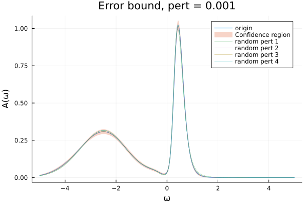

# ACFlowSensitivity
<!-- 

-->

`ACFlowSensitivity` is a package to reimplement analytic continuation methods in [`ACFlow`](https://github.com/huangli712/ACFlow) and use Automatic Differentiation and other methods to analyse these algorithms' sensitivity.

For input $\mathcal{G}=\{G(iw_n)\}_{n=1}^N$ and analytic continuation algorithm

And use $L_2$ norm as a loss function to measure its sensitivity:

$$\text{Loss}(\mathcal{G,G_0}) = \|\text{reA}-\text{reA}_0\|_2=\sqrt{\sum_{j=1}^M|\widetilde{A}_j-\widetilde{A_{0}}_{j}^2|w_j}$$

Here $\text{reA}$ means the reconstructed spenctral density function and $w_j$ is the integral weight of the output mesh.

As a result we calculate:

$$\nabla f(\mathcal{G})=\left(\frac{\partial \widetilde{A}_j}{\partial \mathcal{G}_k}\right)_{M\times N}$$

$$\frac{\partial \text{Loss}(\mathcal{G,G_0})}{\partial \mathcal{G}}|_{\mathcal{G=G_0}}$$

Our purpose is to implement following methods (not all) and their sensitivity analysis:

|Method|reimplement|Sensitivity Analysis|
|:---|:---|:---|
|BarRat(no prony)|✅||
|MaxEnt Chi2kink|✅|✅|
|SSK||
|SAC||
|SPX||
|SOM||
|NAC||

By using `ACFlowSensitivity`, you can get a error bound:

