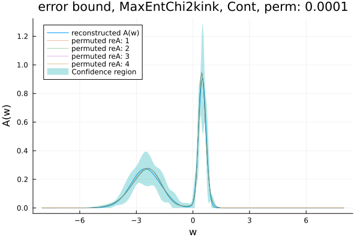
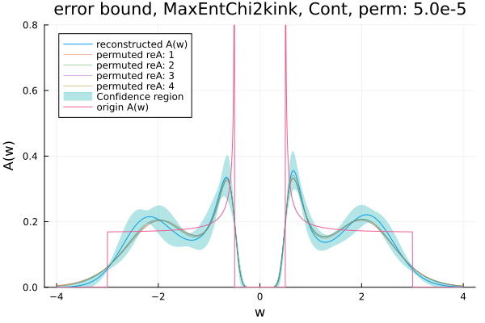

# ACFlowSensitivity
<!-- 

-->

`ACFlowSensitivity` is a Julia package that reimplements and enhances analytic continuation methods from [`ACFlow`](https://github.com/huangli712/ACFlow). It provides tools for analyzing the sensitivity of these algorithms using automatic differentiation and other advanced techniques.

For input $\mathcal{G}=\{G(iw_n)\}_{n=1}^N$ and analytic continuation algorithm

Here $\text{reA}$ means the reconstructed spenctral density function and $w_j$ is the integral weight of the output mesh.

As a result we calculate:

=\left(\frac{\partial\widetilde{A}_j}{\partial\mathcal{G}_k}\right)_{M\times%20N})

Our purpose is to implement following methods (not all) and their sensitivity analysis (`RI` means reimplement. `SA` means Sensitivity Analysis for both fermionic and bosonic systems (Only fermionic now). `cont,delta,mixed` are spectrum types):

|Method|RI cont|RI delta|RI mixed|SA cont|SA delta|SA mixed|
|:---|:---|:---|:---|:---|:---|:---|
|BarRat|✅|✅||✅|✅|
|MaxEnt Chi2kink|✅|✅||✅|✅||
|MaxEnt Bryan|✅|✅||✅|✅||
|MaxEnt Classic|✅|✅||✅|✅||
|MaxEnt Historic|✅|✅|||||
|SSK|✅|✅||✅|✅||
|SAC|✅|✅||✅|✅||
|SPX|✅|✅||✅|✅||
|SOM|✅|✅||✅|✅||
|NAC|✅|✅||✅|✅||

Example of using `ACFlowSensitivity` to plot the error bound of a specific method is shown in the file folder `plot`.

By using `ACFlowSensitivity`, you can get a error bound like this:

