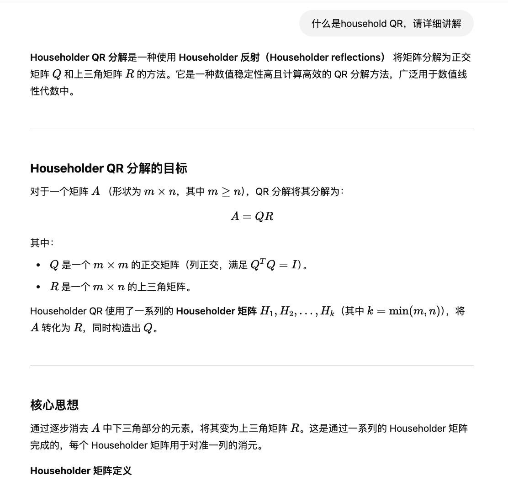
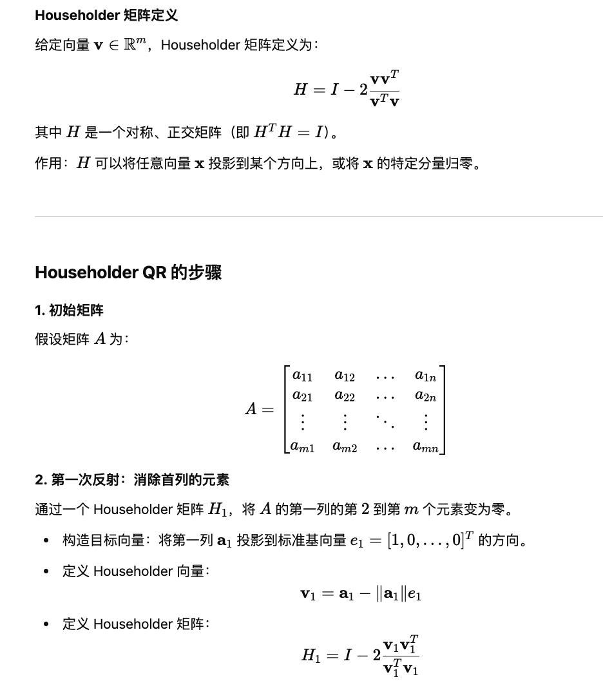
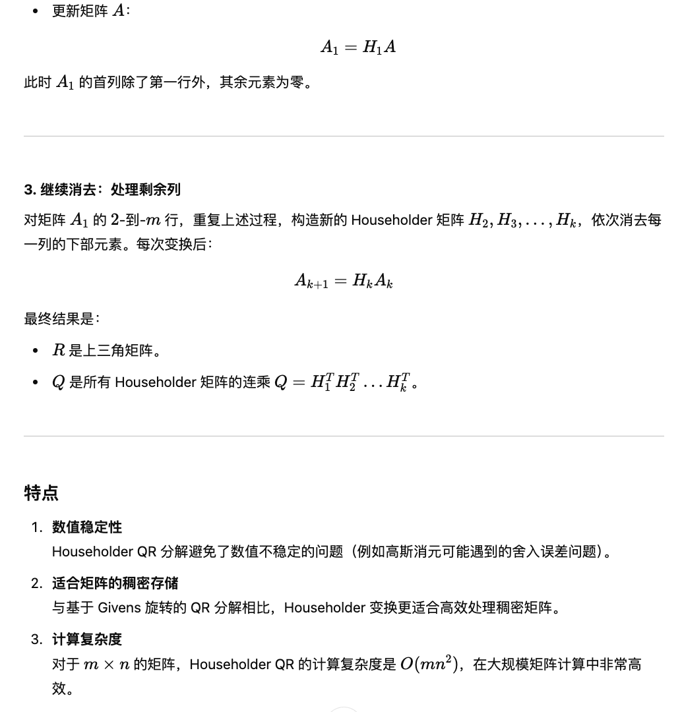
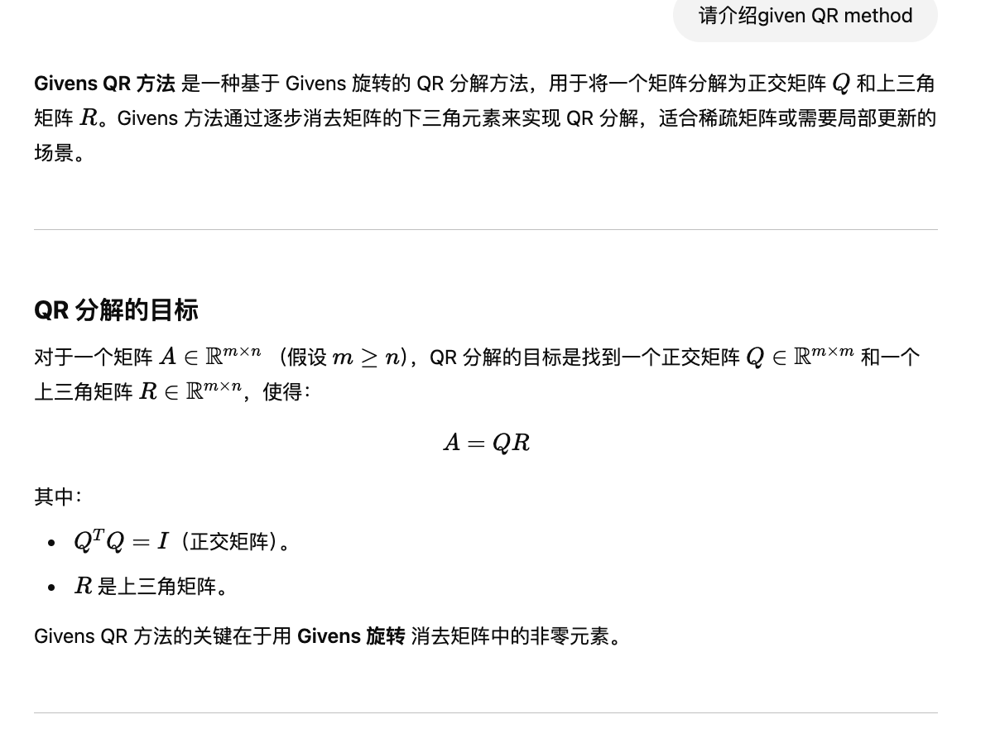
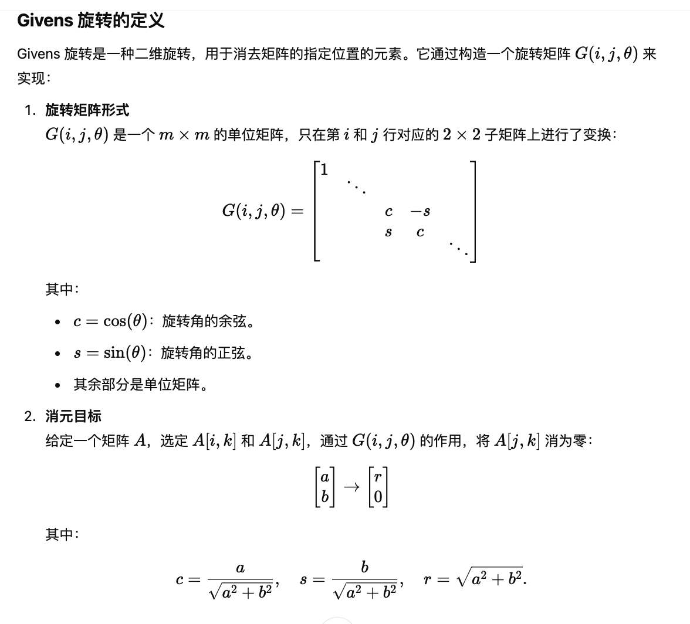
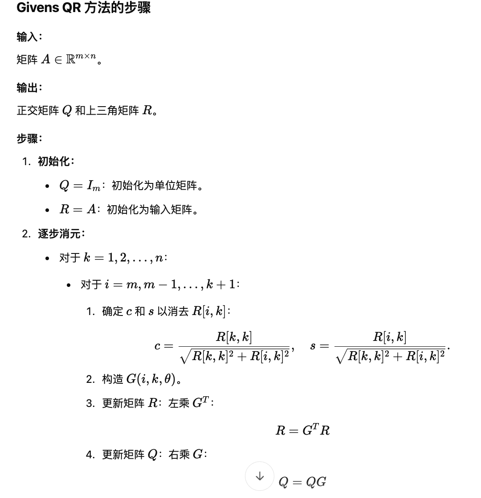
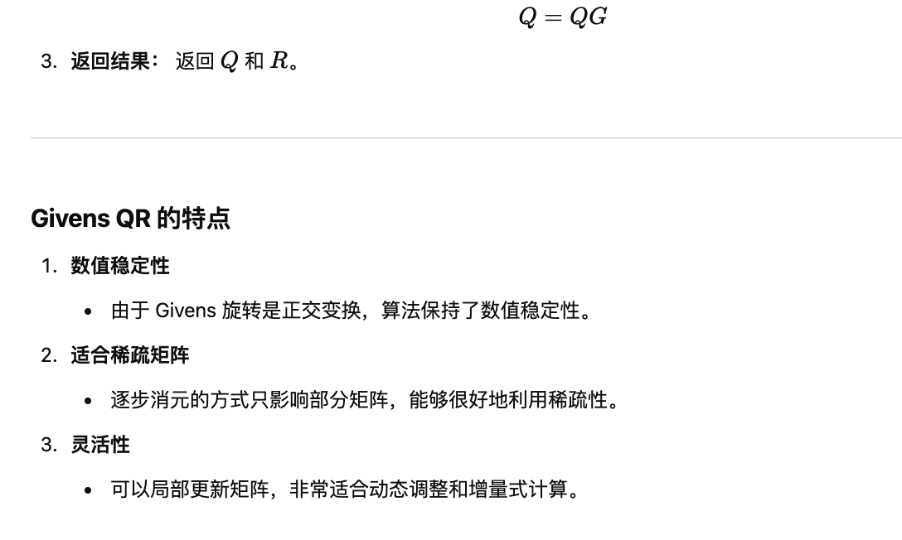

1. For the error of QR decomposition:
   If $A$ is a column full rank matrix and 
   $$A=QR,~A\in\mathbb{F}^{m\times n},~Q\in\mathbb{F}^{m\times n},~R\in\mathbb{F}^{n\times n}$$

   where $Q$ is column orthogonal matrix, $R$ is upper triangular matrix with no negative diagonal entries. 
   Denote $k(A)$ as the condition number of $A$. Then:
   $$error(A)=O(\varepsilon)\Longrightarrow error(Q),error(R)=O(k(A)*\varepsilon)$$

2. Concrete algorithm of QR decomposition.
   
   
   

3. Concrete algorithm of Givens QR decomposition.
   
   
   
   

4. Golub-Kahan SVD algorithm.

5. Jacobi SVD algorithm.