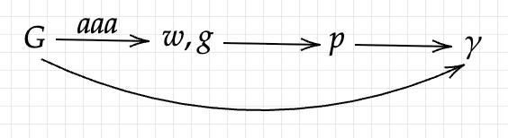

## Flow chart:

Find poles of BarRatFunc(w,g,v) by solve:
$$\sum_{j=1}^m\frac{w_j}{z-g_j} = 0$$

So for a given $p_l$:
$$-\sum_{j=1}^m\frac{w_j}{(p_l-g_j)^2}\frac{\partial p_l}{\partial w_k^r} + \frac{1}{p_l-g_k} = 0 $$

$$-\sum_{j=1}^m\frac{w_j}{(p_l-g_j)^2}\frac{\partial p_l}{\partial w_k^i} + \frac{i}{p_l-g_k} = 0 $$

$$-\sum_{j=1}^m\frac{w_j}{(p_l-g_j)^2}\frac{\partial p_l}{\partial g_k^r} + \frac{1}{(p_l-g_k)^2} = 0$$

$$-\sum_{j=1}^m\frac{w_j}{(p_l-g_j)^2}\frac{\partial p_l}{\partial g_k^i} + \frac{i}{(p_l-g_k)^2} = 0$$

And we get $p_r=real(p)$ as the real poles.

For $p\to\gamma$:
$$(K_r'K_r+K_i'K_i)\gamma = K_r'G_r+K_i'G_i$$

in which:
$$K = \left(\frac{1}{iw_j-p_k}\right)_{N\times m}$$

Directly use `Zygote.jacobian` is okay.