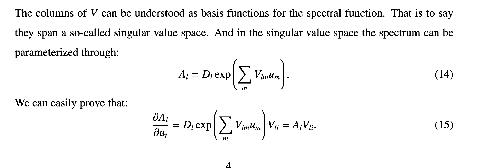

In last letter, my question is:
Why do you think (and that is right):

$$ A_{opt} \in \mathcal{S} = \{{\rm diagm}\}(m)\exp(Vu)  $$

or at least $A_{opt}$ is close to this $\mathcal{S}$?

In your note, you state that you do this but don't give a detailed explanation:

So I want to know why you think this is a good parameterization form?
