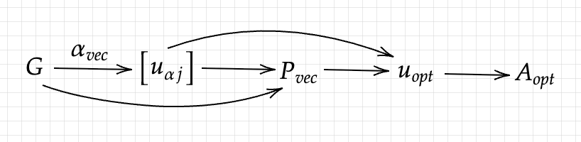

# 0. Denotation and Basic Functions

The original Green's function is denoted as
$$\cal{G}(z), \Im z>0$$
The input data is 
$$G = \left[\real({\cal{G}}(i\omega_1)),..,\real({\cal{G}}(i\omega_N), \Im({\cal{G}}(i\omega_1)),..,\Im({\cal{G}}(i\omega_N))\right]$$

The output grid (mesh) and its weight is denoted as
$$w = [w_1,..,w_M],~\delta = [\delta_1,..,\delta_M],~W := \text{diag}(w), ~\Delta:=\text{diag}(\delta)$$

The kernel is
$$K = \left[\begin{matrix}\real(\frac{1}{i\omega_j-w_k})_{j,k}\\ \Im(\frac{1}{i\omega_j-w_k})_{j,k}\end{matrix}\right] \approx U\Sigma V^T$$

Our purpose is to find a real vector $A$ on mesh. It's related reconstructed Green's Function's values is denoted as:
$$\widetilde{G} = K\Delta A$$

Then
$$\chi^2(A, G) = \|\frac{G-K\Delta A}{\sigma}\|^2_2$$

$$\nabla_A\chi^2 = \frac{2}{\sigma^2}\Delta K'(K\Delta A-G)$$

$$\nabla_G\chi^2 = \frac{2}{\sigma^2}(G - K\Delta A)$$

The default model is denoted as 
$$d = [d_1,..,d_M], D = \text{diag}(d)$$

Then we for 2 types of entropy $S$:

$$S_{sj}(A) = \delta^T * (A_{sj} - d - A_{sj} \circ \ln(A_{sj} \circ/d)), ~ A_{sj} = d \circ \exp\circ (Vu)$$

$$S_{br}(A) = \delta^T(1 \circ- A \circ/d + \log\circ(A\circ/d)), ~d^{-1}-A_{br}^{-1} = Vu$$

$$\nabla_A S_{sj} =\nabla_A S_{br}= -\Delta Vu$$

$$\frac{\partial A_{sj}}{\partial u} = \text{diag}(A)V$$

$$\frac{\partial A_{br}}{\partial u} = \text{diag}(A)^2 V$$

Here the inverse of a vector is inverse of every element of it.

Besides, if the Green's function is the offdiag element, the spectrum can be nonpositive. So we replace 
$$A(u) \to A^{od}(u) = A(u) - A(-u)$$

About the optimization:
$$Q(A,\alpha,G) = -\frac{1}{2}\chi^2(A,G) + \alpha S(A)$$

Our purpose is to find the $A$ that minimize the $Q$. We make it by
$$\nabla_A Q = 0$$

Denote
$$f(u,\alpha, G) = -V'\Delta^{-1}\nabla_A Q(A(u),G,\alpha), ~ u_{\alpha}(\alpha, G): f(u_{\alpha},G,\alpha) = 0$$

It's easy to prove that: 
$$f(u,\alpha, G) = 0 \Longleftrightarrow \nabla_A Q(A(u),G,\alpha) = 0$$

Easy to get:
$$S_{sj}',~S_{br}' = -\Delta Vu$$

Then we can get that:
$$f(u,\alpha, G) = \alpha u + \frac{1}{\sigma^2}\Sigma U'(K\Delta A-G)$$

And
$$J(u,\alpha, G) = \frac{\partial f}{\partial u}(u,\alpha, G) = \alpha I + \frac{1}{\sigma^2}\Sigma^2V'\Delta \frac{\partial A}{\partial u}$$

$$\frac{\partial f}{\partial \alpha} = u$$

$$\frac{\partial f}{\partial G} = -\frac{1}{\sigma^2}\Sigma U'$$

Do differentiation of $f(u_{\alpha},\alpha, G)=0$ with respect to $G$, we get:
$$J\frac{\partial u_{\alpha}}{\partial G} + \frac{\partial f}{\partial G} = 0$$

$$\Longrightarrow \frac{\partial u_{\alpha}}{\partial G} = -J^{-1}\frac{\partial f}{\partial G}$$

# 1. Chi2kink

Here $p$ satisfies:
$$\frac{\partial \text{sgmls}(\log_{10}(\alpha_{vec}), \log_{10}(\chi^2_{vec}), p)}{\partial p} = 0$$

($\text{sgmls}$ means "loss function of the sigmod function", $p = [a,b,c,d]$)

$$\text{sgmls}(x, y, p) = \sum_{j =1}^L  \left(a+\frac{b}{1+\exp(-c(x_j-d))}-y_j\right)^2$$

$$\nabla_p \text{sgmls},~ \frac{\partial^2 \text{sgmls}}{\partial p^2}, ~\frac{\partial^2 \text{sgmls}}{\partial p\partial y } = ...$$

$$f(u_{opt}(G), \alpha_{opt}(G),G) = 0$$

Do differentiation of both sides of the formula:
$$J\frac{\partial u_{opt}}{\partial G} + \frac{\partial f}{\partial \alpha}\frac{\partial \alpha_{opt}}{\partial G} +\frac{\partial f}{\partial G} = 0$$

$$\frac{\partial u_{opt}}{\partial G} =  -J^{-1}\left(\frac{\partial f}{\partial G} + u\frac{\partial \alpha_{opt}}{\partial G}\right)$$

For $\frac{\partial \alpha_{opt}}{\partial G}$:

$$\frac{\partial \chi^2_{vec}[j]}{\partial G} = \frac{\partial \chi^2}{\partial A}\frac{\partial A}{\partial u}\frac{\partial u_{\alpha j}}{\partial G} + \frac{\partial \chi^2}{\partial G}$$

$$\frac{\partial p}{\partial \chi^2} = -\left(\frac{\partial^2 \text{sgmls}}{\partial p^2}\right)^{-1}\left(\frac{\partial^2 \text{sgmls}}{\partial p\partial y}\text{diag}\left(\log_{10}(\chi^2_{vec})\right)\right)$$

$$\frac{\partial   \alpha_{opt}}{\partial p} = [0, 0, \alpha_{opt} \ln(10), \alpha_{opt} \ln(10) \frac{\text{fit\_pos}}{d^2}]$$

`fit_pos` is a control parameter for avoiding under/overfitting. And finally:

$$\frac{\partial \alpha_{opt}}{\partial G} = \frac{\partial \alpha_{opt}}{\partial p}\frac{\partial p}{\partial \chi^2}\frac{\partial \chi^2_{vec}}{\partial G}$$

# 2. Bryan

$$T_{sj}(A) = \left[\sqrt{\frac{A_j}{\delta_j}}\right]_j, ~~T_{br}(A) = \left[\frac{A_j}{\sqrt{\delta_j}}\right]_j$$

Denote:
$$H = \Delta K'K\Delta$$

$$[\lambda_1, .., \lambda_M] = \sigma(\text{diag}(T)H\text{diag}(T))$$

$$P(A,G) = \exp\left(\alpha S-\frac{1}{2}\chi^2+\ln\alpha +\frac{1}{2}\sum_{j=1}^M\ln\frac{\alpha}{\alpha +\lambda_j}\right)$$

$$= \alpha^{M/2+1}\exp(Q)\frac{1}{\sqrt{(\alpha+\lambda_1)...(\alpha+\lambda_M)}}$$

$$ = \alpha^{M/2+1}\exp(Q)\frac{1}{\sqrt{\det(\alpha I + \text{diag}(T)H \text{diag}(T))}}$$

$$\Longrightarrow \nabla_GP = P\nabla_G Q$$

$$\nabla_A P = P\left(\frac{\partial Q}{\partial A} -\frac{1}{2}\frac{1}{\det(\alpha I + \text{diag}(T)H \text{diag}(T))}(\frac{\partial T}{\partial A})^T \nabla_T \det(\alpha I + \text{diag}(T)H \text{diag}(T))\right)$$

$$ = P\left(\frac{\partial Q}{\partial A} -\frac{1}{2}\frac{1}{\det(..)}\frac{\partial T}{\partial A}2\det(..)\text{diag}\left(..^{-1}\text{diag}(T)H\right)\right)$$

$$ = P\left(\frac{\partial Q}{\partial A} -\frac{\partial T}{\partial A}\text{diag}\left(..^{-1}\text{diag}(T)H\right)\right)$$

resize $P_{vec}$:

$$P^{norm}_{vec} = \text{trapz}(P_{vec}, \alpha_{vec})$$

Here the $\text{trapz}(y, x)$ is the integration of $y$ on $x$

The the final $u_{opt}$ is:

$$A_{opt} = \text{trapz}(A\circ(u_{\alpha vec}), \alpha_{vec})$$

The jacobian of the function:

$$u_{\alpha vec},P_{vec} \to A_{opt}$$

can be easily solved by AD program with low cost.

# 3. Historic
$$\chi^2(A(u_{\alpha vec}),G) = N$$

$$\Longrightarrow \frac{\partial \chi^2}{\partial A}\frac{\partial A}{\partial u}[\frac{\partial u_{\alpha}}{\partial \alpha}\frac{\partial \alpha_{opt}}{\partial G} + \frac{\partial u_{\alpha}}{\partial G}] + \frac{\partial \chi^2}{\partial G} = 0$$

$$\Longrightarrow \frac{\partial\alpha_{opt}}{\partial G} = -[\frac{\partial \chi^2}{\partial A}\frac{\partial A}{\partial u}\frac{\partial u_{\alpha}}{\partial \alpha}]^{-1}\left[\frac{\partial \chi^2}{\partial G}+\frac{\partial \chi^2}{\partial A}\frac{\partial A}{\partial u}\frac{\partial u_{\alpha}}{\partial G}\right]$$

And
$$u_{opt}(G) = u_{\alpha}(\alpha_{opt}(G),G)$$

$$\Longrightarrow \frac{\partial u_{opt}}{\partial G} = \frac{\partial u_{\alpha}}{\partial G} + \frac{\partial u_{\alpha}}{\partial \alpha}\frac{\partial \alpha_{opt}}{\partial G}$$

# 4. Classic
$$-2\alpha_{opt}S = \text{Tr}[\frac{\text{diag}(T)H\text{diag}(T)}{\alpha_{opt} I +\text{diag}(T)H\text{diag}(T)}]$$

$$\Longrightarrow -2\left(\frac{\partial \alpha_{opt}}{\partial G}S+\alpha_{opt}\frac{\partial S}{\partial A}\left[\frac{\partial u_{\alpha}}{\partial \alpha}\frac{\partial \alpha_{opt}}{\partial G} + \frac{\partial u_{\alpha}}{\partial G}\right]\right)$$

$$= 2\alpha_{opt}\left[ \text{diag}(H\text{diag}(T)(\alpha_{opt} I +\text{diag}(T)H\text{diag}(T))^{-2} \right]^{T}\frac{\partial T}{\partial A}\frac{\partial A}{\partial u}\left[\frac{\partial u_{\alpha}}{\partial \alpha}\frac{\partial \alpha_{opt}}{\partial G} + \frac{\partial u_{\alpha}}{\partial G}\right]$$

$$\Longrightarrow \frac{\partial \alpha_{opt}}{\partial G} = -\alpha_{opt}\left[S + \alpha_{opt}\left[\text{diag}(...)^T\frac{\partial T}{\partial A}+\frac{\partial S}{\partial A}\right]\frac{\partial A}{\partial u}\frac{\partial u_{\alpha}}{\partial \alpha}\right]^{-1}   \left[\text{diag}(...)^T\frac{\partial T}{\partial A}+\frac{\partial S}{\partial A}\right]\frac{\partial A}{\partial u}\frac{\partial u_{\alpha}}{\partial G}$$
