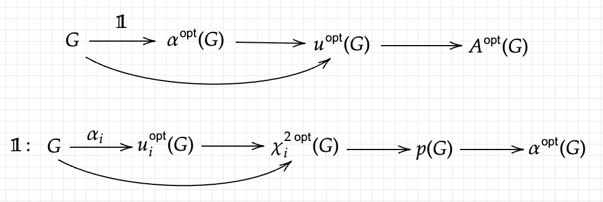

# 1. Chi2cink

$$A(u) = m\circ \exp(Vu)$$

$$\frac{\partial A}{\partial u} = \text{diag}(A)V$$

$$\chi^2(A) = \frac{1}{\sigma^2}(G-\widetilde{G})'(G-\widetilde{G}) = \frac{1}{\sigma^2}(K\text{diag}(w)A-G)'(K\text{diag}(w)A-G)$$

$$\frac{\partial \chi^2}{\partial A}=\frac{2}{\sigma^2}\text{diag}(w)K'(K\text{diag}(w)A-G)$$

$$\frac{\partial \chi^2}{\partial G} = \frac{2}{\sigma^2}(G-K\text{diag}(w)A)$$

$$\text{SJ} = A-m-A\circ \ln(A \circ/ m)$$

$$\frac{\partial \text{SJ}}{\partial A} = -\text{diag}(w)\ln(A\circ/m)=-\text{diag}(w)Vu$$

$$Q(A) = \alpha\text{SJ}-\frac{1}{2}\chi^2$$

$$\frac{\partial Q}{\partial A} = -\text{diag}(w)V(\alpha u+\frac{1}{\sigma^2}SU'(K\text{diag}(w)A-G))$$

$$\frac{\partial Q}{\partial A}=0 \Longleftrightarrow J(u) = \alpha u+\frac{1}{\sigma^2}SU'(K\text{diag}(w)A-G)=0$$

$$H(u) = \frac{\partial J}{\partial u} = \alpha I+\frac{1}{\sigma^2}S^2V'\text{diag}(w)\text{diag}(A)V$$

-------
# 2. Differentiation of chi2cink
$$\text{Function}:J(u,\alpha,G),\chi^2(u,G)$$

$$J(u^{\text{opt}}_i,\alpha_i,G)=0\\
\Longrightarrow \frac{\partial u^{\text{opt}}_i}{\partial G} = -(\frac{\partial J}{\partial u})^{-1} \frac{\partial J}{\partial G} = -H^{-1}\frac{\partial J}{\partial G}
$$

$$\frac{\partial \chi^{2~\text{opt}}_i}{\partial G} = \frac{\partial \chi^{2}}{\partial u}\frac{\partial u^{\text{opt}}_i}{\partial G}+\frac{\partial \chi^{2}}{\partial G}$$

For curve fitting:
$$\text{loss}(p,x,y) = \sum_{i=1}^L(p_1+\frac{p_2}{1+\exp(-p_3(x_i-p_4))}-y_i)^2$$

$$\frac{\partial \text{loss}}{\partial p} (p^{\text{opt}}(y),x,y)=0\\
\Longrightarrow \frac{\partial p^{\text{opt}}}{\partial y} = -(\frac{\partial \text{loss}}{\partial p})^{-1} \frac{\partial \text{loss}}{\partial y}
$$

For $\alpha^{\text{opt}}$ to $u^{\text{opt}}$
$$J(u^{\text{opt}},\alpha^{\text{opt}},G)=0\\

\Longrightarrow \frac{\partial u^{\text{opt}}}{\partial G} = -(\frac{\partial J}{\partial u})^{-1} \left(\frac{\partial J}{\partial \alpha}\frac{\partial \alpha^{\text{opt}}}{\partial G}+\frac{\partial J}{\partial G} \right) 

= -H^{-1} \left(\frac{\partial J}{\partial \alpha}\frac{\partial \alpha^{\text{opt}}}{\partial G}+\frac{\partial J}{\partial G} \right)
$$

Supple differentiation:
$$\frac{\partial J}{\partial G} = -\frac{1}{\sigma^2}SU'$$

$$\frac{\partial J}{\partial \alpha} = u$$

# 3. Differentiation of $L^2$ loss function

$$f:\mathbb{C}^n \to \mathbb{C}^m,~\frac{\partial f(x)}{\partial x_r}=A,~\frac{\partial f(x)}{\partial x_i}=B$$

$$\text{loss}(x) = \|f(x)-f(x_0)\|_{L^2} = \sqrt{\sum_{i=1}^m w_i |f(x_i)-y_{0i}|^2}$$

$$\Longrightarrow \text{loss}^2(dx) = \sum_{i=1}^m w_i |Adx_r+Bdx_i|^2$$

$$= X'[A,B]'\text{diag}(w)[A,B]X,~X=[x_r|x_i]$$

Denote
$$U,S,V = \text{svd}\left(\sqrt{\text{diag}(w)}[A,B]\right)$$

So when the direction of $X$ is $V[1]$, the loss increase most rapidly. And the speed is $S[1]$. So the gradient is $S[1]V[1]$.

