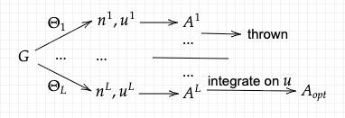

Given a default model $m(w)$, define the cumulative distribution function and field distribution as:
$$x = \phi(\omega) = \int_{-\infty}^{\omega} m(\omega') d\omega'$$
$$n(x) = \frac{A(\phi^{-1}(x))}{m(\phi^{-1}(x))}$$

Then the Hamiltonian is:
$$H[n(x)] =\chi^2\left(m(\omega)n(x), G^R\right) =   \int_0^{\beta}d\tau \frac{1}{\sigma(\tau)^2} \left|\int_0^1 dx K(\tau, \phi^{-1}(x)) n(x) - G(x)\right|^2$$

For different inverse temperature $\Theta$, do MCMC as fwllows:
$$n(x) = \sum_{k=1}^{n_p}a_k\delta(x-p_k)\\
\sum_{k=1}^{n_p}a_k = 1,~a_k\geq0, 0\leq p_k\leq 1\\
p(n_1\to n_2) = \exp\left(-\Theta\left(H[n_2]-H[n_1]\right)\right)
$$

to get:
$$
\mathbb{E}(n(x)), u = \mathbb{E}(H[n(x)]) 
$$

And to get the spectrum:
$$A = F\mathbb{E}(n)\\
F[n](\omega) = m(\omega)^{-1}\frac{1}{\pi}\sum_{k}\frac{a_k\eta}{(\phi(\omega)-p_k)^2+\eta^2}
$$

Then use two lines to fine the first several $(\Theta_j, u_j)$ and the final several $(\Theta_j, u_j)$ by linear fitting. The intersection of the two lines is minimum acceptable $\Theta_0$. We only choos those $\Theta_j > \Theta_0$ and do an integral of $(u,A)$ and then normalize it to get the final spectrum.

$$A_{\text{opt}} = \frac{\sum_{j=j_0}^{L-1}A^j(u^j-u^{j+1})}{u^{j_0}-u^L}$$

--------------------------------
# Differentiation

Denote
$$A^j = F\mathbb{E}(n^j)\\
F = \text{diag}(\varphi)\frac{1}{\pi}\left(\frac{\eta}{(\phi_j-x_k)^2+\eta^2}\right)_{jk}
$$

Here $[x_k]_k$ means the fine mesh for MCMC on $[0,1]$. So:

$$\frac{\partial \mathbb{E}(n)}{\partial G^R} = 2\Theta\mathrm{Cov}(n,n)K'\Sigma^{-2}$$

$$\frac{\partial A}{\partial G^R} = F\frac{\partial \mathbb{E}(n)}{\partial G^R}\\
= 2\Theta\left(\mathbb{E}(Fn n'K')-A\mathbb{E}(n'K')\right)\Sigma^{-2}
$$

We assume that with little perturbation, the $j_0$ will not change. Solve the differential of $\left([A^j]_j,[u^j]_j\right)\to A_{\text{opt}}$ is easy. So we only calculate $\frac{\partial u^j}{\partial G^R}$.

$$\mathbb{E}[f(x,\theta)] = \int f(x,\theta)p(x,\theta)dx\\
\Longrightarrow \frac{\partial \mathbb{E}[f(x,\theta)]}{\partial \theta} = \int f(x,\theta)\frac{\partial p(x,\theta)}{\partial \theta}dx + \int p(x,\theta)\frac{\partial f(x,\theta)}{\partial \theta}dx\\
= \mathbb{E}[f(x,\theta)\frac{\partial \log(p(x,\theta))}{\partial \theta}] + \mathbb{E}[\frac{\partial f(x,\theta)}{\partial \theta}]\\
= \mathrm{Cov}(f,\frac{\partial}{\partial \theta}\log(p_0)) + \mathbb{E}[\frac{\partial f(x,\theta)}{\partial \theta}]\\
$$

$$\Longrightarrow \frac{\partial \mathbb{E}(\chi^2(A,G))}{\partial G^R} = \mathrm{Cov}(A, \frac{\partial}{\partial G^R}\log(p_0)) + \mathbb{E}(\frac{\partial \chi^2}{\partial G^R})\\
= \mathrm{Cov}(\chi^2, -2\Theta h) + 2\mathbb{E}(h)\\
 = -2\Theta\mathbb{E}(\chi^2 h) + 2\left(\Theta\mathbb{E}(\chi^2)+1 \right)\mathbb{E}(h)
$$

1
1
1
1
1
1
1
1
1
1
1
1
1
1
1
1
1
11
1
1
1
1
1
1
1
11
1
1
1
1
1
1
1
11
1
1
1
1
1
1
1
11
1
1
1
1
1
1
1
11
1
1
1
1
1
1
1
11
1
1
1
1
1
1
1
11
1
1
1
1
1
1
1
11
1
1
1
1
1
1
1
1