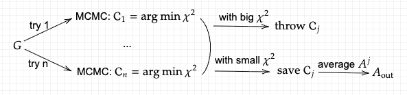

# Basic Flow

Perform $n$ independent try and for every try, do the following steps and save the configuration with the minimum $\chi^2$:

1. Sample
$$\mathcal{C} = \left[(c_j,h_j,w_j)\right]_{j=1}^m$$

2. Denote:
$$D[\mathcal{C}] = \sum_{j=1}^N \left\|G_j - \sum_{k=1}^m h_k\log\left(\frac{i\omega_k-e^1_k}{i\omega_j-e^2_k}\right)\right\|^2\\
e_k^1 = c_k-w_k/2, e_k^2 = c_k+w_k/2
$$

3. Two step transition respectively with probability:

$$P(\mathcal{C}\to \mathcal{C}') = \left(\frac{D[\mathcal{C}]}{D[\mathcal{C}']}\right)^{1 + \mathcal{U}(0,1)}\\
P(\mathcal{C}\to \mathcal{C}') = \left(\frac{D[\mathcal{C}]}{D[\mathcal{C}']}\right)^{2 + \mathcal{U}(0,1)}
$$

4. Check whether the new configuration owns a smaller $\chi^2$ and if so, record it.

Then get a criterion to decide what configurations to be saved:

$$\mathrm{good} = \mathrm{median}(\chi^2_{\mathrm{vec}})/\mathrm{factor},~\mathrm{factor} = 1.2 ~\mathrm{or}~ 1.0$$

$$\mathcal{C}_{\mathrm{vec}} \leftarrow \mathcal{C}\in\mathcal{C}_{\mathrm{vec}}:\chi^2(\mathcal{C}) < \mathrm{good}$$

The take the average of the $A$ obtained from the saved configurations:

$$A_{\text{out}} = \frac{1}{|\mathcal{C}_{\mathrm{vec}}|}\sum_{\mathcal{C}\in\mathcal{C}_{\mathrm{vec}}}A_{\mathcal{C}}$$

# Differentiation

Difficulty: it does not follow a general MCMC and it's hard to get any information about its distribution and thus it's hard to get the derivative of the expectation: $A_{\text{out}}$.