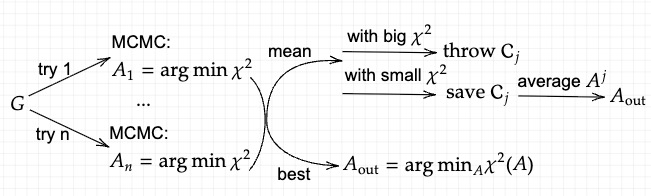

# Basic Flow

Perform $n$ independent try and for every try, do the following steps and save the configuration with the minimum $\chi^2$:

1. Sample on a fine mesh:
$$A \in [0,1]^{M_1},~\mathrm{nnz}(A) = p, ~\sum_j A_j = 1$$

2. Given the inverse temperature $\Theta$, do MCMC with the transition probability:
$$P(A\to A') = \exp\left(-\Theta\Delta\chi^2\right)$$

Denote saved $A$ as $A_{\mathrm{vec}}$. If "method" is "best", then:
$$A_{\text{out}} = \arg\min_{A\in A_{\mathrm{vec}}} \chi^2(A, G)$$

3. If $A'$ is accepted with a smaller $\chi^2$, then update $A$ and $\chi^2$.

If "method" is "mean", then get a criterion to decide what configurations to be saved:
$$\mathrm{good} = \mathrm{median}(\chi^2_{\mathrm{vec}})/\mathrm{factor},~\mathrm{factor} = 1.2 ~\mathrm{or}~ 1.0$$

$$\mathcal{A}_{\mathrm{vec}} \leftarrow \mathcal{A}\in\mathcal{A}_{\mathrm{vec}}:\chi^2(\mathcal{A}) < \mathrm{good}$$

And then take the average of the $A$ obtained from the saved configurations:
$$A_{\text{out}} = \frac{1}{|\mathcal{A}_{\mathrm{vec}}|}\sum_{\mathcal{A}\in\mathcal{A}_{\mathrm{vec}}}A_{\mathcal{A}}$$

--------------------------------

# Differentiation

For Delta uotput we only use method = "best" and for Cont output we only use method = "mean". For "best", we can just take differential on $\chi^2=0$.

For "mean":
Difficulty: it does not follow a general MCMC and it's hard to get any information about its distribution and thus it's hard to get the derivative of the expectation: $A_{\text{out}}$.
