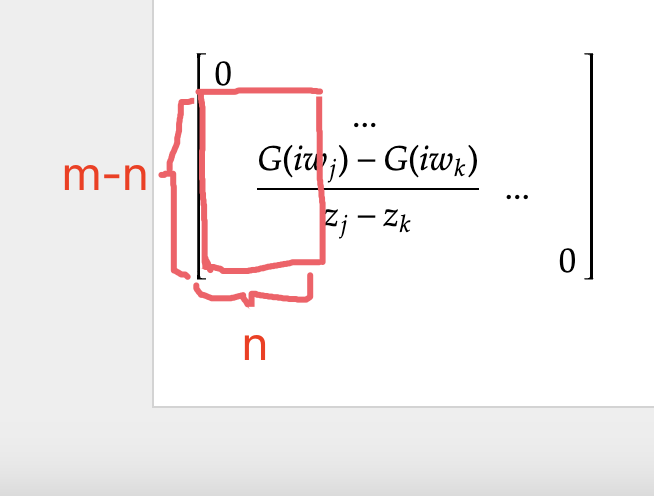

$\rm 1. ~Explanation ~of ~poles$
We have proven that for $A(x)\in\mathcal{S}:$
$$\lim_{z\to w,{\rm Im}z\neq0}\int_R\frac{A(x)}{z-x}dx=P.V.\int_R\frac{A(x)}{w-x}dx-i\pi{\rm sgn}(\eta)A(w)$$

And therefore every point $w$ s.t. $A(w)>0$ is a sigularity on $\mathbb{R}$.

Pole is a kind of isolated sigularity. So there is no poles on $\mathbb{R}$.

And we can prove that with a good $A(x)$ we can analytic extend $G(z),~Imz>0$ to the whole complex plane.

Refer to [Discussion About Poles Of Green functions](<//Users/yui/projects/Lecture/Report 6/Discussion About Poles Of Green functions.pdf>) for details.

$\rm 2.~How~ descrete~ spectral ~change ~to ~continous~ gradually$

Please refer to above pdf as well.

$\rm 3.~ How ~aaa ~algorithm ~work $
It's a interesting algorithm because it's most important idea is not barycentric but deviding a set of points into 2 parts. One of them is insert points set and the second is checking points set.

The reason is you can't decide the weight just with all ponits as insert points.

Denote chosen points as $A$, and set of waiting points as $B$. Assume that 
$$A=\{z_1,..,z_n\},~B=\{z_{n+1},..,z_m\}$$

Now consider:
$$L=\left(\frac{G(z_j)-G(z_k)}{z_j-z_k}\right)_{jk}$$

Then we get a sub matrix $L_n$ from it by get the first $n$ columns and $n+1,.,m$ rows. 

Now for 
$$G(z)\simeq \frac{N_n(z)}{D_n(z)}$$

$$N_n(z)=\sum_{j=1}^n\frac{w_jG(z_j)}{z-z_j},~D_n(z)=\sum_{j=1}^n\frac{w_j}{z-z_j}$$

We have 
$$\left(GD_n-N_n\right)(B)=L_nw$$

$$\Longrightarrow \min_w\|(GD_n-L_n)(B)\|_{L^2}=\min_w\|L_nw\|=\min \sigma(L_n)$$

Then we can use svd to find such $\min \sigma(L_n)$ and related $w$.

Then we chose 
$$z_{new}={\rm argmax}_{z\in B}~\left|G(z)-\frac{N_n(z)}{D_n(z)}\right|$$

Add $z_{new}$ into $A$ and delete it from $B$ and continue iteration.

Now we see the code.

(Refer to ACFlowSensitivity)

$\rm 4. ~Discrete ~G ~with~ pole$

It's easy to check that by adjusting $w$, $\frac{N}{D}$ can be a function with some poles.

Why I don't test ACFlow: It claims that its barycentric method is not stable and in fact it does. For a Descrete example, its barycentric method can't find any poles and give a error. But infact even if we just ues the aaa writen by myself, it can reconstruct atleast one pole.

$\rm 5.~ Improvement~of ~aaa$

(1) How to proportionally adjust the weights in the Barycentric algorithm ?

(2) The idea of aaa can be transmitted to descrete situation by replacing Lowner mateix with Cauchy matrix.

